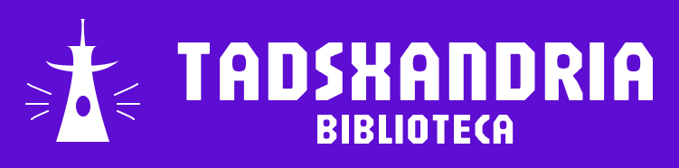

# TADSxandria Biblioteca

Nossa proposta do TADSxandria é ser um repositório público dos trabalhos e projetos desenvolvidos pelos discentes do curso TADS do IFRN CNAT. 

Com o TADSxandria, será possível compartilhar seus projetos acadêmicos com qualquer público, além de visualizar projetos anteriores e seus processos de desenvolvimento.

# Equipe e Formas de Contato

A principal forma de contato entre a equipe é o __Discord__. 

| __Discente__      | __Github__                                              | __Discord__   |
| ----------------- | ------------------------------------------------------- | ------------- |
| Ana Barbosa       | [anabsz](https://github.com/anabsz)                     | anabs.dev     |
| Arthur Mariz      | [arthursm-aqb](https://github.com/arthursm-aqb)         | katchoro1635  |
| Arthur Fontenele  | [FonteneleGm](https://github.com/FonteneleGm)            | FonteneleGm  |
| Bia Borba         | [Parkeryyy](https://github.com/Parkeryyy)               | spiderthey    |
| Erick Job         | [Erickjob](https://github.com/Erickjob)                 | olhoneitor    |
| Gustavo Dias      | [GustavoDiasdLima](https://github.com/GustavoDiasdLima) | gubennet      |
| Miguel Rodrigues  | [Migstand](https://github.com/Migstand)                 | Miguas 2006   |
| Raquel Martiniano | [Raquel-M325](https://github.com/Raquel-M325)           | Raquel MFP    |

Em cada perfil do Github fica disponível outras formas de contato, a critério de cada membro.

# Horário de Reuniões

| __Dias__ | __Horários__  | __Local__  | __Orientação?__ |
| -------- | ------------- | -----------| --------------- |
| Quarta   | 10:30 - 12:00 | IFRN CNAT  | Sim             |
| Quinta   | 19:30 - 20:30 | _Online*_  | Não             |

> *Reuniões online serão feitas através da plaforma __Discord__.

<!-- 
> [!TIP]
> Obs.: é fortemente recomendado que todas as reuniões da equipe sejam registradas na forma de tarefas (*issues*), contendo essencialmente informações como: presentes, temas discutidos e os encaminhamentos. Essas tarefas devem ser marcadas com o label correspondente. 
-->

# Documentação

Clique em cada um dos links abaixo para acessar o artefato específico.

1. [Documento de Visão](doc/visao/doc-visao.md)
2. [Protótipos de Interface com o Usuário](doc/prototipos/prototipos.md)
3. [Modelo de Casos de Uso](doc/cdu/cdu.md)
4. [Modelo de Domínio](doc/dominio/dominio.md)
5. [Modelo de Dados](doc/bd/bd.md)

<!-- 
> [!TIP]
> As aplicações Django devem ser organizadas em Modelos (*Models*), Visões (*Views*) (com seus Templates) e Serviços (*Services*), conforme orientações detalhadas acessíveis através do seguinte [LINK](doc/projeto/orientacao.md).
-->

# Manual da Desenvolvedor

[Orientações para os desenvolvedores do projeto](doc/guia-ds/guia.md)
