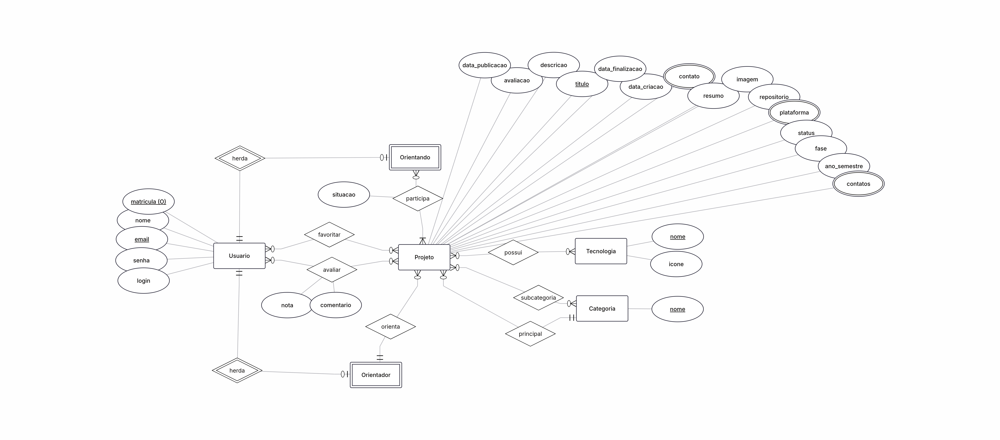
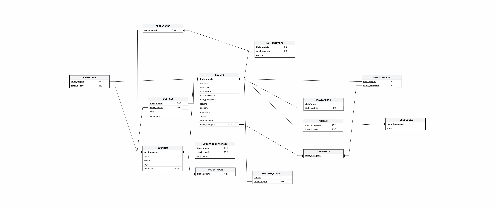

# Modelo de Dados

## Histórico de Revisões

| Data | Versão | Descrição | Autores |
| :--: | :----: | :-------: | :-----: |
| 17/05/2026 | 1.0.0 | Versão inicial |  Arthur Mariz, Arthur Fontenele, Ana Barbosa, Beatriz Borba, Gustavo Dias, Erick Job, Miguel da Hora e Raquel Martiniano |
| - | - | - |  - |

## 1. Diagrama ER

> Substitua pela imagem do diagrama ER...

[LINK para o arquivo com o modelo](#)

## 2. Modelo Relacional

> Substitua pela imagem do Modelo Relacional...

[LINK para o arquivo com o modelo](#)

## 3. Dicionário de Dados

--- 
**Tabela** : usuarios

*Descrição* : Armazena os dados dos usuários logados no sistema

*Observações* : ...

| Colunas | Descrição | Tipo de Dado | Tamanho | Null | PK | FK | Unique | Identity | Default | Check | 
| ------- | --------- | ------------ | ------- | ---- | -- | -- | ------ | -------- | ------- | ----- |
| email | endereço de email do usuário | VARCHAR | 254 | &#9744;  | &#9745; | &#9744; | &#9745; | &#9745; |  |  | 
| nome | nome do usuário | CHAR | 255 | &#9744;  | &#9744; | &#9744; | &#9744; | &#9744; |  |  | 
| senha | senha criptografada do sistema | VARCHAR | 128 | &#9744;  | &#9744; | &#9744; | &#9744; | &#9744; |  |  | 
| login | login do sistema | VARCHAR | 254 | &#9744;  | &#9744; | &#9744; | &#9744; | &#9744; |  |  | 
| matricula | matricula do usuário | CHAR | 14 | &#9745;  | &#9744; | &#9744; | &#9744; | &#9745; |  |  |

--- 
**Tabela** : Avaliar

*Descrição* : Armazena as avaliações do projetos

*Observações* : ...

| Colunas | Descrição | Tipo de Dado | Tamanho | Null | PK | FK | Unique | Identity | Default | Check | 
| ------- | --------- | ------------ | ------- | ---- | -- | -- | ------ | -------- | ------- | ----- |
| [nome da coluna] | [descrição da coluna] | [tipo_de_dado] | [tamanho - se necessário] | &#9745;  | &#9744; | &#9744; | &#9744; | &#9744; | [default - se necessário] | [outras restrições - se necessário] | 
| titulo_projeto | titulo do projeto | CHAR | 255 | &#9744;  | &#9745; | &#9745; | &#9744; | &#9744; |  |  |
| email_usuario | endereço de email do usuário | VARCHAR | 254 | &#9744;  | &#9745; | &#9745; | &#9744; | &#9744; |  |  |
| nota | nota do projeto | INT |  | &#9745;  | &#9744; | &#9744; | &#9744; | &#9744; |  |  |
| comentario | comentário a respeito do projeto | TEXT | 255 | &#9745;  | &#9744; | &#9744; | &#9744; | &#9744; |  |  |

--- 
**Tabela** : Favoritar

*Descrição* : Armazena as avaliações do projetos

*Observações* : ...

| Colunas | Descrição | Tipo de Dado | Tamanho | Null | PK | FK | Unique | Identity | Default | Check | 
| ------- | --------- | ------------ | ------- | ---- | -- | -- | ------ | -------- | ------- | ----- |
| titulo_projeto | titulo do projeto | CHAR | 255 | &#9744;  | &#9745; | &#9745; | &#9744; | &#9744; |  |  |
| email_usuario | endereço de email do usuário | VARCHAR | 254 | &#9744;  | &#9745; | &#9745; | &#9744; | &#9744; |  |  |

--- 
**Tabela** : orientadores

*Descrição* : Armazena os dados dos orientadores

*Observações* : ...

| Colunas | Descrição | Tipo de Dado | Tamanho | Null | PK | FK | Unique | Identity | Default | Check | 
| ------- | --------- | ------------ | ------- | ---- | -- | -- | ------ | -------- | ------- | ----- |
| email | endereço de email do orientador | VARCHAR | 254 | &#9744;  | &#9744; | &#9745; | &#9744; | &#9744; |  |  |

--- 
**Tabela** : OrientadorProjeto

*Descrição* : Armazena os dados dos orientadores

*Observações* : ...

| Colunas | Descrição | Tipo de Dado | Tamanho | Null | PK | FK | Unique | Identity | Default | Check | 
| ------- | --------- | ------------ | ------- | ---- | -- | -- | ------ | -------- | ------- | ----- |
| titulo_projeto | titulo do projeto | CHAR | 255 | &#9744;  | &#9745; | &#9745; | &#9744; | &#9744; |  |  |
| email_usuario | endereço de email do orientador | VARCHAR | 254 | &#9744;  | &#9745; | &#9745; | &#9744; | &#9744; |  |  |
| participacao | A situação da participação do orientador no projeto | CHAR | 255 | &#9744;  | &#9744; | &#9744; | &#9744; | &#9744; |  |  |

--- 
**Tabela** : orientandos

*Descrição* : Armazena os dados dos orientadores

*Observações* : ...

| Colunas | Descrição | Tipo de Dado | Tamanho | Null | PK | FK | Unique | Identity | Default | Check | 
| ------- | --------- | ------------ | ------- | ---- | -- | -- | ------ | -------- | ------- | ----- |
| matricula_orientando | matricula do usuário | CHAR | 14 | &#9744;  | &#9745; | &#9744; | &#9745; | &#9745; |  |  |
| email | endereço de email do orientando | VARCHAR | 254 | &#9744;  | &#9744; | &#9745; | &#9744; | &#9744; |  |  |

--- 
**Tabela** : participacao

*Descrição* : Armazena os dados das situações dos participantes do projeto

*Observações* : ...

| Colunas | Descrição | Tipo de Dado | Tamanho | Null | PK | FK | Unique | Identity | Default | Check | 
| ------- | --------- | ------------ | ------- | ---- | -- | -- | ------ | -------- | ------- | ----- |
| titulo_projeto | titulo do projeto | CHAR | 255 | &#9744;  | &#9745; | &#9745; | &#9744; | &#9744; |  |  |
| email_usuario | endereço de email do orientando | VARCHAR | 254 | &#9744;  | &#9745; | &#9745; | &#9744; | &#9744; |  |  |
| situacao | titulo do projeto | CHAR | 255 | &#9745;  | &#9744; | &#9744; | &#9744; | &#9744; |  |  |

--- 
**Tabela** : possui

*Descrição* : tabela intermediária para tecnologia

*Observações* : ...

| Colunas | Descrição | Tipo de Dado | Tamanho | Null | PK | FK | Unique | Identity | Default | Check | 
| ------- | --------- | ------------ | ------- | ---- | -- | -- | ------ | -------- | ------- | ----- |
| nome_tecnologia | nome da tecnologia do projeto projeto | CHAR | 255 | &#9744;  | &#9745; | &#9744; | &#9744; | &#9744; |  |  |
| titulo_projeto | titulo do projeto | CHAR | 255 | &#9744;  | &#9745; | &#9745; | &#9744; | &#9744; |  |  |

--- 
**Tabela** : tecnologias

*Descrição* : Armazena os dados das tecnologias presentes nos projetos

*Observações* : ...

| Colunas | Descrição | Tipo de Dado | Tamanho | Null | PK | FK | Unique | Identity | Default | Check | 
| ------- | --------- | ------------ | ------- | ---- | -- | -- | ------ | -------- | ------- | ----- |
| nome | nome do tipo da tecnologia | CHAR | 255 | &#9744;  | &#9745; | &#9744; | &#9744; | &#9744; |  |  |
| icone | Caminho/URL o arquivo da imagem |  |  | &#9745;  | &#9744; | &#9744; | &#9744; | &#9744; |  |  | 

--- 
**Tabela** : projetos

*Descrição* : Armazena os dados dos projetos

*Observações* : ...

| Colunas | Descrição | Tipo de Dado | Tamanho | Null | PK | FK | Unique | Identity | Default | Check | 
| ------- | --------- | ------------ | ------- | ---- | -- | -- | ------ | -------- | ------- | ----- |
| titulo_projeto | titulo do projeto | CHAR | 255 | &#9744;  | &#9745; | &#9744; | &#9745; | &#9745; |  |  |
| avaliacao | avaliação referente ao desempenho do trabalho | FLOAT| | &#9745;  | &#9744; | &#9744; | &#9744; | &#9744; |  |  | 
| descricao | texto descritivo do projeto | TEXT | 500 | &#9744;  | &#9744; | &#9744; | &#9744; | &#9744; |  |  | 
| data_criacao | data de criação do projeto | DATETIME | | &#9744;  | &#9744; | &#9744; | &#9744; | &#9744; |  |  | 
| data_finalizacao | data de finalização do projeto | DATETIME |  | &#9745;  | &#9744; | &#9744; | &#9744; | &#9744; |  |  | 
| data_publicacao | data de publicação do projeto | DATETIME |  | &#9744;  | &#9744; | &#9744; | &#9744; | &#9744; |  |  |  
| resumo | contem um texto resumido sobre o projeto | TEXT | 2000 | &#9744;  | &#9744; | &#9744; | &#9744; | &#9744; |  |  | 
| imagem | imagem da logo do projeto |  |  | &#9744;  | &#9744; | &#9744; | &#9744; | &#9744; |  |  | 
| repositorio | contém o link para acessar o repositório | URL| 500 | &#9744;  | &#9744; | &#9744; | &#9744; | &#9744; |  |  |
| status | status que se encontra o repositório | CHAR | 20 | &#9744;  | &#9744; | &#9744; | &#9744; | &#9744; | andamento |  |
| ano_semestre | status que se encontra o repositório | CHAR | 20 | &#9744;  | &#9744; | &#9744; | &#9744; | &#9744; |  |  |
| nome_categoria | Categoria principal do projeto | CHAR | 255 | &#9744;  | &#9744; | &#9745; | &#9744; | &#9744; |  |  |

--- 
**Tabela** : projeto_contato

*Descrição* : Armazena todos os contatos dos orientandos

*Observações* : ...

| Colunas | Descrição | Tipo de Dado | Tamanho | Null | PK | FK | Unique | Identity | Default | Check | 
| ------- | --------- | ------------ | ------- | ---- | -- | -- | ------ | -------- | ------- | ----- |
| contato | o contato dos usuários do projeto | VARCHAR | 500 | &#9744;  | &#9745; | &#9744; | &#9744; | &#9744; |  |  |
| titulo_projeto | titulo do projeto | CHAR | 255 | &#9744;  | &#9745; | &#9745; | &#9744; | &#9744; |  |  |

--- 
**Tabela** : categorias

*Descrição* : Armazena os dados das categorias

*Observações* : ...

| Colunas | Descrição | Tipo de Dado | Tamanho | Null | PK | FK | Unique | Identity | Default | Check | 
| ------- | --------- | ------------ | ------- | ---- | -- | -- | ------ | -------- | ------- | ----- |
| nome_categoria | Categoria principal do projeto | CHAR | 255 | &#9744;  | &#9745; | &#9744; | &#9744; | &#9744; |  |  |
| nome_id| Subcategoria | CHAR | 255 | &#9745;  | &#9745; | &#9745; | &#9744; | &#9745; |  |  | 

--- 
**Tabela** : Subcategoria

*Descrição* : Armazena os dados das subcategorias

*Observações* : ...

| Colunas | Descrição | Tipo de Dado | Tamanho | Null | PK | FK | Unique | Identity | Default | Check | 
| ------- | --------- | ------------ | ------- | ---- | -- | -- | ------ | -------- | ------- | ----- |
| titulo_projeto | titulo do projeto | CHAR | 255 | &#9744;  | &#9745; | &#9745; | &#9744; | &#9744; |  |  |
| nome_categoria | Categoria principal do projeto | CHAR | 255 | &#9744;  | &#9745; | &#9745; | &#9744; | &#9744; |  |  |

--- 
**Tabela** : plataforma

*Descrição* : Armazena o tipo da plataforma

*Observações* : ...

| Colunas | Descrição | Tipo de Dado | Tamanho | Null | PK | FK | Unique | Identity | Default | Check | 
| ------- | --------- | ------------ | ------- | ---- | -- | -- | ------ | -------- | ------- | ----- |
| plataforma | A plataforma que o projeto para a qual esta sendo feito | CHAR | 20 | &#9744;  | &#9744; | &#9744; | &#9744; | &#9744; |  |  |
| titulo_projeto | titulo do projeto | CHAR | 255 | &#9744;  | &#9745; | &#9745; | &#9744; | &#9744; |  |  |

