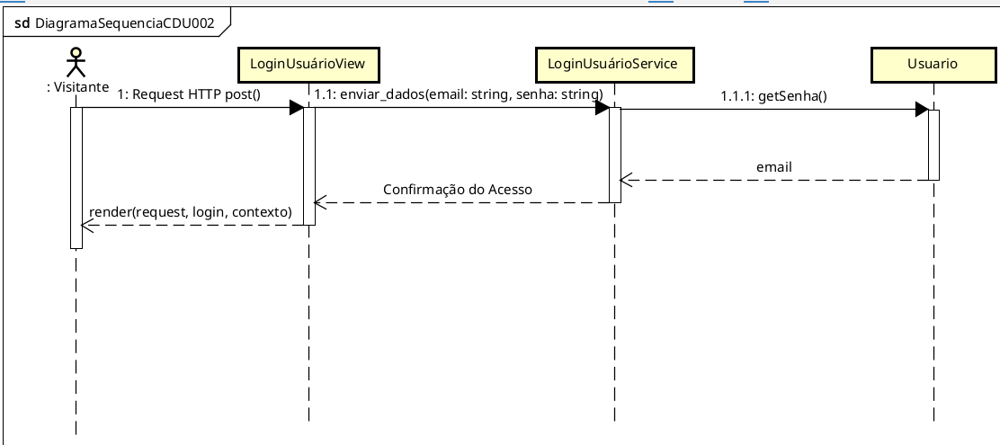

# CDU002. Login

- **Ator principal**: Visitante
- **Atores secundários**: ...	 
- **Resumo**: Este caso de uso decreve a ação de um visitante que irá efetuar login na sua conta cadastrada no sistema.
- **Pré-condição**: O úsuário deve possuir cadastro no sistema.
- **Pós-Condição**: ...

## Fluxo Principal
| Ações do ator | Ações do sistema |
| :-----------------: | :-----------------: | 
| 1 - O Visitante preenche o formulário com as informações do seu respectivo cadastro (o seu e-mail e sua senha). | |  
| | 2 - O sistema da opção do usuário visualizar a senha digita para o mesmo confirmar se não cometeu erros de digitação. |
| 3 - O usuário clica no botão "Entrar". | |  
| | 4 - O sistema confirma as informações e o usuário é redirecionado para a próxima página. | 

## Fluxo Alternativo I - Informações Inválidas
| Ações do ator | Ações do sistema |
| :-----------------: |:-----------------: | 
| 1.1 - O orientador não preenche o cadastro com informações válidas | |  
| | 4.1 - O sistema envia uma mensagem dizendo que o cadastro ou alguma informação não foi preenchida corretamente. |

## Fluxo Alternativo II - Métodos de Login Alternativos
| Ações do ator | Ações do sistema |
| :-----------------: | :-----------------: | 
| 1.2 - O Visitante escolhe um método alternativo de login clicando no botão "Fazer login com Google" ou "Fazer login com Github". | |  
| | 4.2 - O sistema redireciona para a respectiva página de login do respectivo serviço externo selecionado. |

## Fluxo Alternativo III - Usuário esqueceu a Senha
| Ações do ator | Ações do sistema |
| :-----------------: | :-----------------: | 
| 1.3 - O Visitante clica na opção "Esqueci minha senha". | |  
| | 4.3 - O sistema redireciona para a respectiva página de recuperação de senha. |

## Fluxo Alternativo IV - Usuário não possui cadastro
| Ações do ator | Ações do sistema |
| :-----------------: | :-----------------: | 
| 1.3 - O Visitante clica na opção "Cadastre-se". | |  
| | 4.3 - O sistema redireciona para a respectiva página de criação de cadastro. |

> Obs. as seções a seguir apenas serão utilizadas na segunda unidade do PDSWeb (segundo orientações do gerente do projeto).

## Diagrama de Interação (Sequência ou Comunicação)

## Diagrama de Classes de Projeto

