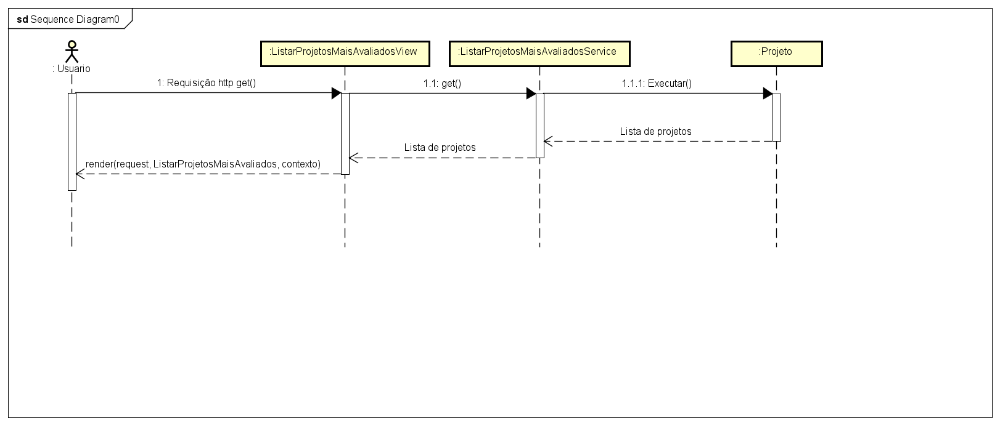

# CDU003. Listar projetos mais avaliados... 

- **Ator principal**: Todos ...
- **Atores secundários**: Todos...	 
- **Resumo**: O usuário é capaz de listar os projetos mais avaliados do site ...
- **Pré-condição**: Estar no site...
- **Pós-Condição**: O sistema retorna os projetos mais avaliados do site...

## Fluxo Principal
| Ações do ator | Ações do sistema |
| :-----------------: | :-----------------: | 
| 1 - O ator está na pagina inicial e visualiza os projetos mais avaliados... |  |  
| | 2 - o sistema mostra na pagina inicial os projetos mais avaliados ... | 

## Fluxo Alternativo I - Não há avaliações
| Ações do ator | Ações do sistema |
| :-----------------: |:-----------------: | 
| 1.1 - O ator está na pagina inicial e não visualiza os projetos mais avaliados...| |  
| | 2.1 - O sistema não mostra os projetos mais avaliados por não haver avaliações...  |
 

> Obs. as seções a seguir apenas serão utilizadas na segunda unidade do PDSWeb (segundo orientações do gerente do projeto).

## Diagrama de Interação (Sequência ou Comunicação)

> 

## Diagrama de Classes de Projeto

> Substituir pela imagem contendo as classes (modelo, visão e templates) que implementam o respectivo CDU...
