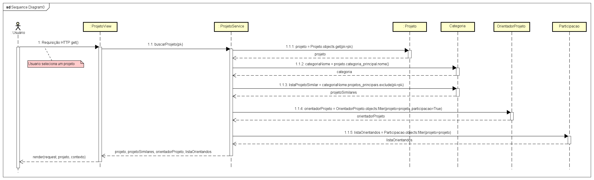
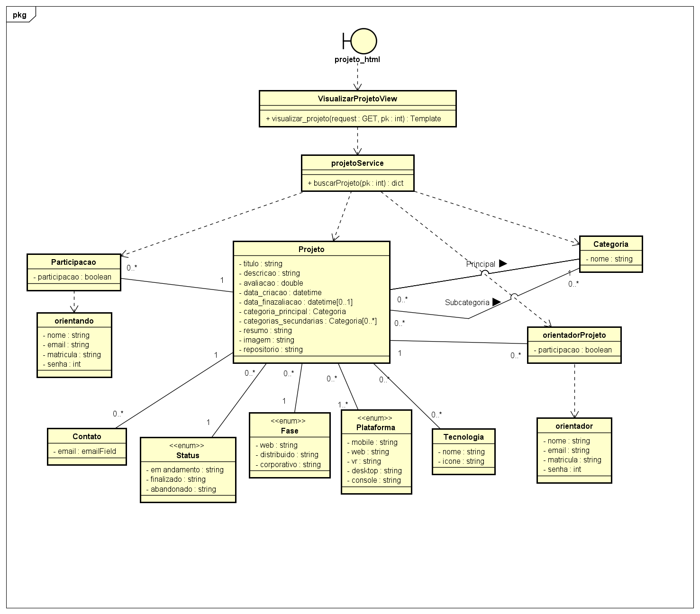

# CDU004. Visualizar Projeto 

- **Ator principal**: Todos (Visitante, Comum, Orientado e Orientador)
- **Atores secundários**: Nenhum	 
- **Resumo**: Este caso descreve os passos para que o usuário acesse a visualização de um projeto no sistema.
- **Pré-condição**: Listar o projeto via mecanismos de busca e projeto existir no banco de dados. 
- **Pós-Condição**: O sistema apresenta a interface gráfica dos dados do projeto.

## Fluxo Principal
| Ações do ator | Ações do sistema |
| :-----------------: | :-----------------: | 
| 1 - O usuário clica em um projeto via busca, recomendações (similares ou mais avaliados) ou perfil. | |  
| | 2 - O sistema recebe a requisição do usuário para página do projeto. |
| | 3 - O sistema valida que o projeto existe no banco de dados do sistema e está publico. | 
| | 4 - O sistema redireciona o usuário para página do projeto.| 

> Obs. as seções a seguir apenas serão utilizadas na segunda unidade do PDSWeb (segundo orientações do gerente do projeto).

## Diagrama de Interação (Sequência ou Comunicação)

## Diagrama de Classes de Projeto

