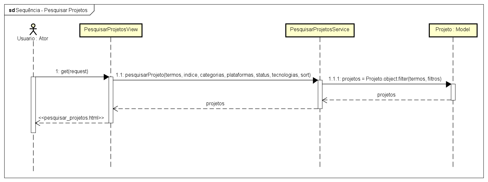

# CDU006. Pesquisar Projetos 

- **Ator principal**: TODOS
- **Resumo**: O usuário pode pesquisar por projetos públicos cadastrados no sistema, utlizando a barra de pequisa e filtros auxiliares.
- **Pré-condição**: Acessar o sistema.
- **Pós-Condição**: O sistema exibe os projetos que correspondem com a busca feita pelo usuário.

## Fluxo Principal
| Ações do ator | Ações do sistema |
| ----------------- | ----------------- | 
| 1 - O usuário digita termos ou textos relacionados aos projetos que está buscando. |  |  
| | 2 - O sistema processa esses termos e faz a listagem dos projetos correspondentes. | 
| | 3 - O sistema exibe para o usuário a página de pesquisa de projetos com a listagem da pesquisa. |

## Fluxo Alternativo I - Pesquisa com filtros
| Ações do ator | Ações do sistema |
| ----------------- |----------------- | 
| 1.1 - O usuário seleciona filtros para buscar os projetos. | |  
| | 2.1 - O sistema processa os filtros e faz a listagem dos projetos correspondentes. |
| | 3.1 - O sistema exibe para o usuário a página de pesquisa de projetos com a listagem da pesquisa. |

## Fluxo de Exceção I - Projetos não encontrados
| Ações do ator | Ações do sistema |
| ----------------- | ----------------- | 
| | 2.2 - O sistema processa os filtros e termos, mas não encontra projetos correspondentes. |
| | 3.2 - O sistema exibe a página de pesquisa sem listagem de projetos e instruções para novas pesquisas. |  

## Diagrama de Sequência 

## Diagrama de Classes de Projeto

