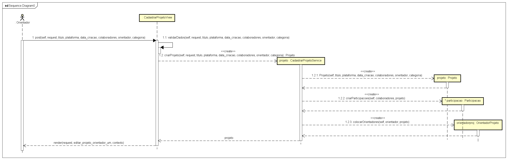
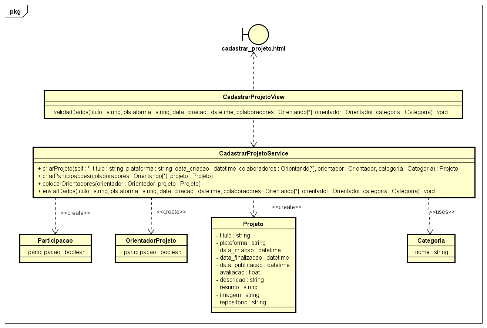

# CDU007. Cadastrar Projetos 

- **Ator principal**: Orientador
- **Atores secundários**: ...	 
- **Resumo**: Este caso de uso decreve a ação de um orientador que irá cadastrar um novo projeto para ser publicado no sistema
- **Pré-condição**: O orientador deve estar na página Painel de Usuário
- **Pós-Condição**: Deve ter pelo menos uma categoria e um colaborador contribuindo para que o projeto seja publicado

## Fluxo Principal
| Ações do ator | Ações do sistema |
| :-----------------: | :-----------------: | 
| 1 - O orientador clica no botão submissões| |  
| | 2 - O sistema direciona o usuário para a seção de submissão de um novo projeto |
| 3 - O orientador preenche as informações do projeto e submete no sistema | |
| | 4 - O sistema envia e confirma a publicação do projeto no site com uma mensagem |

## Fluxo Alternativo I - Informações Incoerentes
| Ações do ator | Ações do sistema |
| :-----------------: |:-----------------: | 
| 3.1 - O orientador não preenche o cadastro com informações válidas | |  
| | 4.1 - O sistema envia uma mensagem dizendo qual seção não foi preenchida corretamente |

## Fluxo Alternativo II - Cancelamento de Cadastro
| Ações do ator | Ações do sistema |
| :-----------------: | :-----------------: | 
| 3.2 - O orientador clica no botão de cancelamento de cadastro do cadastro | |  
| | 4.2 - O sistema confirma o cancelamento de cadastro com uma mensagem |

> Obs. as seções a seguir apenas serão utilizadas na segunda unidade do PDSWeb (segundo orientações do gerente do projeto).

## Diagrama de Interação (Sequência ou Comunicação)

> 

## Diagrama de Classes de Projeto

> 
