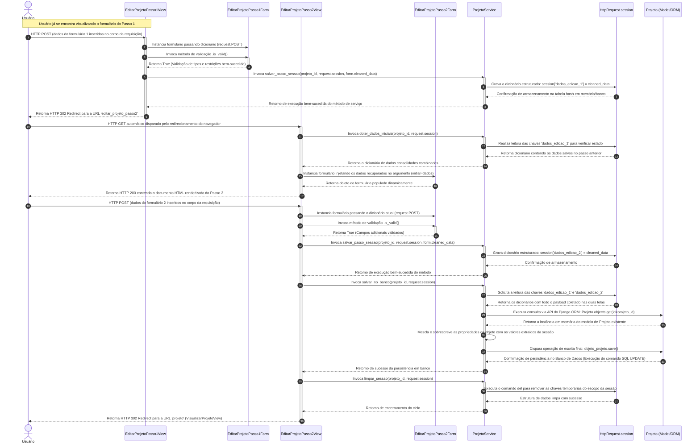

# CDU008. Editar projeto

- **Ator principal**: Usuário orientado
- **Atores secundários**: Usuário orientador	 
- **Resumo**: Esse caso de uso descreve as ações realizadas por usuários que querem editar informações sobre o projeto
- **Pré-condição**: Usuário precisa estar já inserido em um projeto
- **Pós-Condição**: Notificação do sistema dizendo que as mudanças foram salvas

## Fluxo Principal - Usuário do tipo orientado editando o projeto
| Ações do ator | Ações do sistema |
| :-----------------: | :-----------------: | 
| 1 - Usuário abre a página "editar projeto" | |  
| | 2 - O sistema abre a página, onde tem a primeira parte formulário com informações que já foram preenchidas durande a criação do projeto. As informações são: título, plataforma, ano/semestre, colaboradores, contato, orientador, categoria e subcategoria  | 
| 3 - O usuário realiza alterações e depois seleciona a opção avançar para editar outras informações | |
| | 4- O sistema passa para a página seguinte, onde tem as informações: resumo, descrição, ferramentas utilizadas, repositório, status e a imagem, que será a capa do projeto |
| 5 - O usuário realiza alterações e salva as mudanças | |
| | 6 - O sistema envia uma mensagem dizendo "alterações salvas" |

## Fluxo Alternativo I - Usuário do tipo orientador editando o projeto
| Ações do ator | Ações do sistema |
| :-----------------: |:-----------------: | 
| 1.1 - Usuário abre a página "editar projeto" | |  
| | 1.2 - O sistema abre a página, onde tem a primeira parte formulário com informações que já foram preenchidas durande a criação do projeto. As informações são: título, plataforma, colaboradores, contato, orientador, categoria e subcategoria |
| 1.3 - O usuário realiza alterações e depois seleciona a opção avançar para editar outras informações | |
| | 1.4- O sistema passa para a página seguinte, onde tem as informações: resumo, descrição, ferramentas utilizadas, repositório, status e a imagem, que será a capa do projeto |
| 1.5 - O usuário realiza alterações e salva as mudanças | |
| | 1.6 - O sistema envia uma mensagem dizendo "alterações salvas" |

## Fluxo Alternativo II - Colaborador não encontrado
| Ações do ator | Ações do sistema |
| :-----------------: | :-----------------: | 
| 2.1 - Usuário abre a página "editar projeto" | |  
| | 2.2 - O sistema abre a página, onde tem a primeira parte formulário com informações que já foram preenchidas durande a criação do projeto. As informações são: título, plataforma, colaboradores, contato, orientador, categoria e subcategoria |
| 2.3 - O usuário realiza alterações na parte de colaborador mas insere um id não reconhecido pelo sistema e depois seleciona a opção avançar para editar outras informações | |
| | 2.4- O sistema não passa para a página seguinte e envia uma notificação dizendo "Colaborador não encontrado" |

> Obs. as seções a seguir apenas serão utilizadas na segunda unidade do PDSWeb (segundo orientações do gerente do projeto).

## Diagrama de Interação (Sequência ou Comunicação)



## Diagrama de Classes de Projeto

```mermaid
classDiagram
    class EditarProjetoPasso1View {
        +get(request: HttpRequest, projeto_id: int) HttpResponse
        +post(request: HttpRequest, projeto_id: int) HttpResponse
    }

    class EditarProjetoPasso2View {
        +get(request: HttpRequest, projeto_id: int) HttpResponse
        +post(request: HttpRequest, projeto_id: int) HttpResponse
    }

    class EditarProjetoPasso1Form {
        +cleaned_data: dict
        +is_valid() bool
    }

    class EditarProjetoPasso2Form {
        +cleaned_data: dict
        +is_valid() bool
    }

    class ProjetoService {
        +obter_dados_iniciais(projeto_id: int, session: HttpSession) dict
        +salvar_passo_sessao(projeto_id: int, session: HttpSession, cleaned_data: dict) void
        +salvar_no_banco(projeto_id: int, session: HttpSession) void
        +limpar_sessao(projeto_id: int, session: HttpSession) void
    }

    class Projeto {
        +id: int
        +titulo: str
        +descricao: str
        +plataforma: str
        +ano/semestre: str
        +colaboradores: int
        +contatos: str
        +orientador: str
        +categoria: str
        +categoria_secundaria: str
        +resumo: str
        +ferramentas_utilizadas: str
        +repositorio: str
        +status: enum
        +imagem: str
        +save() void
    }

    %% Relacionamentos de Dependência e Uso
    EditarProjetoPasso1View ..> EditarProjetoPasso1Form : "Instancia e Valida"
    EditarProjetoPasso2View ..> EditarProjetoPasso2Form : "Instancia e Valida"
    
    EditarProjetoPasso1View --> ProjetoService : "Invoca Lógica"
    EditarProjetoPasso2View --> ProjetoService : "Invoca Lógica"
    
    ProjetoService --> Projeto : "Consulta e Modifica (ORM)"
