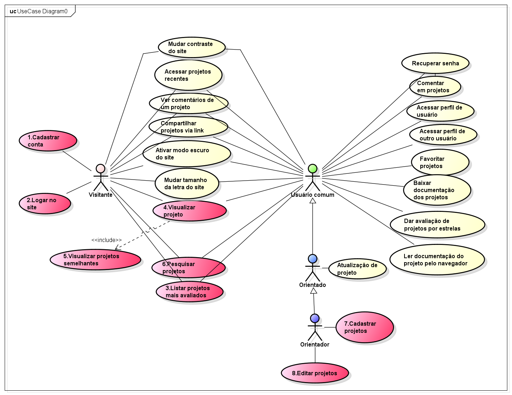
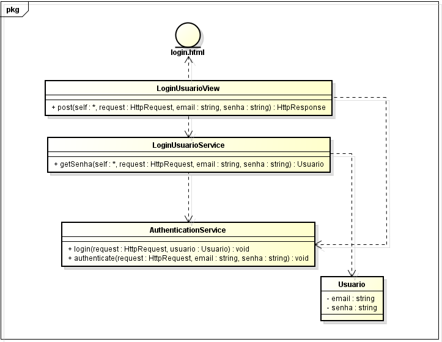
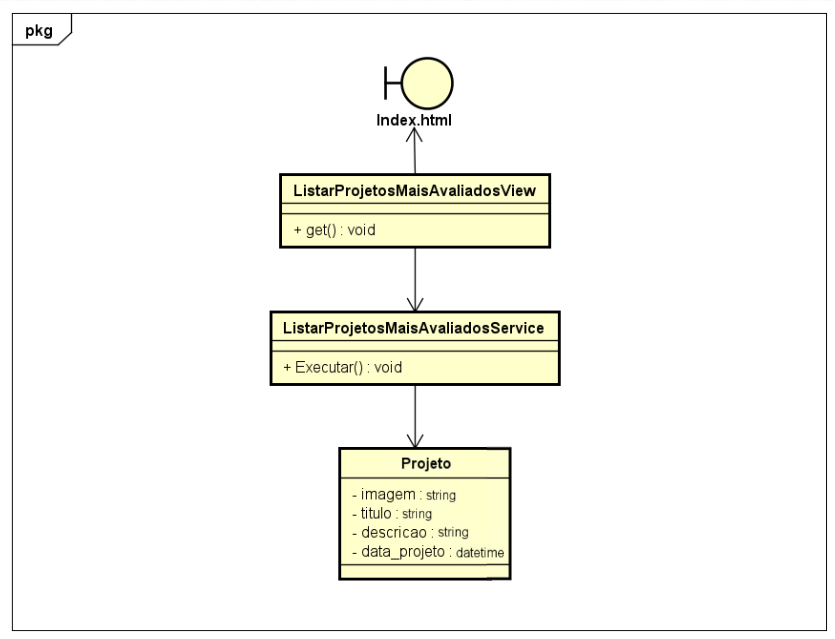
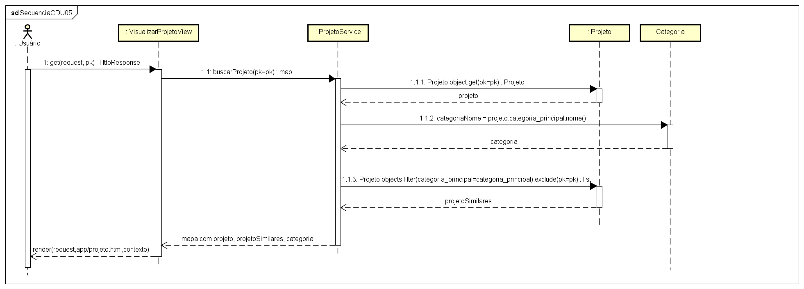
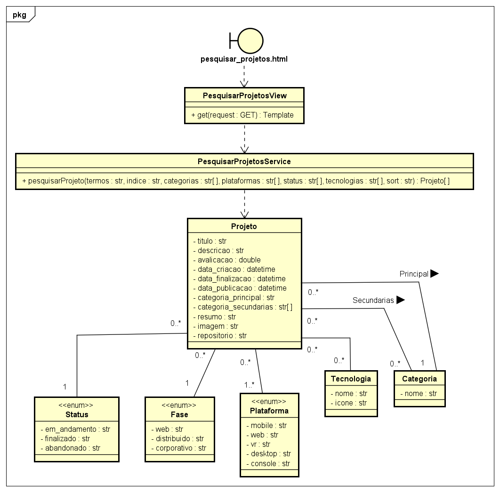

# Modelo de Casos de Uso

## Histórico de Revisões

| Data | Versão | Descrição | Autores |
| :--: | :----: | :-------: | :-----: |
| - | - | Versão inicial |  - |
|  07/05/2026 | Versão atualizada | Casos de uso principais | Gustavo Dias, Miguel Rodrigues |

## 1. Diagrama de Casos de Uso

> Substitua pela imagem do diagrama...

[LINK para o arquivo com o modelo](/doc/arquivo_astah/nome_do_projeto.asta)

## 2. Listagem dos Detalhamentos dos Casos de Uso

1. [CDU 001 - Cadastrar Conta (Raquel)](cdu-001/detalhamento-001.md) 
2. [CDU 002 - Login (Arthur F)](cdu-002/detalhamento-002.md)
3. [CDU 003 - Listar Projetos Mais Avaliados (Gustavo)](cdu-003/detalhamento-003.md)
4. [CDU 004 - Visualizar Projeto (Arthur S)](cdu-004/detalhamento-004.md)
5. [CDU 005 - Visualizar Projetos Similares (Erick)](cdu-005/detalhamento-005.md)
6. [CDU 006 - Pesquisar Projetos (Ana)](cdu-006/detalhamento-006.md)
7. [CDU 007 - Cadastrar Projeto (Miguel)](cdu-007/detalhamento-007.md)
8. [CDU 008 - Editar Projeto (Beatriz)](cdu-008/detalhamento-008.md)

## 3. Diagrama de interações

> CDU 001 - Cadastrar Conta

> CDU 002 - Login

> CDU 003 - Listar Projetos Mais Avaliados

> CDU 004 - Visualizar Projeto

> CDU 005 - Visualizar Projetos Similares

> CDU 006 - Pesquisar Projetos

> CDU 007 - Cadastrar Projeto

