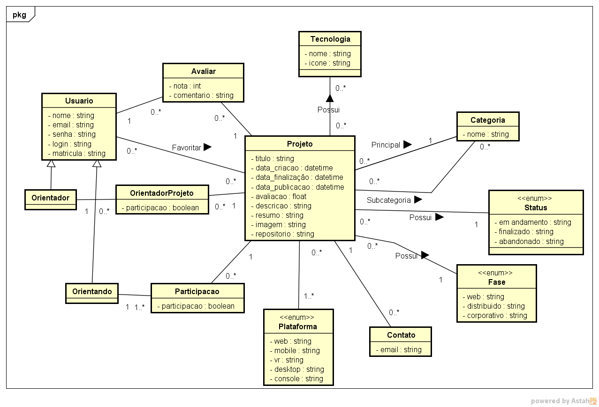

# Modelo de Domínio

## Histórico de Revisões

| Data | Versão | Descrição | Autores |
| :--: | :----: | :-------: | :-----: |
| 13/05/2026 | 1.0.0 | Versão Inicial do Diagrama da classe de domínio |  Ana Barbosa, Arthur da Silva, Arthur Fontenele, Beatriz Borba, Erick Job, Gustavo Dias, Miguel Rodrigues, Raquel Martiniano  |
| 13/05/2026 | 1.1.0 | Correções na Versão inicial do Diagrama da classe de domínio |  Ana Barbosa, Arthur da Silva, Arthur Fontenele, Beatriz Borba, Erick Job, Gustavo Dias, Miguel Rodrigues, Raquel Martiniano |
| 03/06/2026 | 1.4.0 | Correções na Versão v3 do Diagrama da classe de domínio |  Ana Barbosa, Arthur da Silva, Arthur Fontenele, Beatriz Borba, Erick Job, Gustavo Dias, Miguel Rodrigues, Raquel Martiniano |

## 1. Diagrama das Classes Conceituais do Domínio

> Substituir pela imagem do diagrama de classes de domínio...

[LINK para o arquivo com o modelo](/doc/arquivo_astah/nome_do_projeto.asta)

## 2. Glossário (sugestão)

| Termo | Explicação |
| :---: | :--------: |
| Termo 1 | Explicação 1... |
| Termo 2 | Explicação 2... |
