# Protótipos de Interface com o Usuário

## Histórico de Revisões

| Data | Versão | Descrição | Autores |
| :--: | :----: | :-------: | :-----: |
| 05/04/2026 | 1.0.0 | Versão inicial | Arthur da Silva Mariz, Erick Job e Beatriz Borba |
| 13/04/2026 | 1.1.0 | Versão com atualizações na tela de detalhamento dos projetos | Arthur da Silva Mariz, Erick Job e Beatriz Borba |
| 14/04/2026 | 1.1.1 | Versão com melhoria visual em botões da tela de detalhamento dos projetos | Arthur da Silva Mariz, Erick Job e Beatriz Borba |
| 13/05/2026 | 1.2.0 | Versão com revisão dos protótipos (duplicidade) e mapa do site e melhorias de interface | Arthur da Silva Mariz, Erick Job e Beatriz Borba |
| 15/04/2026 | 1.2.0 | Versão com criação da tela favorito | Arthur da Silva Mariz, Erick Job e Beatriz Borba |
| 18/04/2026 | 1.3.0 | Versão com criação da tela de "Meu perfil" do usuário comum, orientado e orientador (professor), ajustes nas telas de favorito, detalhamento dos projetos e Painel de usuário | Arthur da Silva Mariz, Erick Job e Beatriz Borba |
| 21/04/2026 | 1.4.0 | Versão com criação da tela de "Configuações" | Arthur da Silva Mariz, Erick Job e Beatriz Borba |

## 1. Mapa do Site

> Obs.: propõem-se a utilização de alguma ferramenta que possibilite a representação textual do diagrama. como o seguinte exemplo:

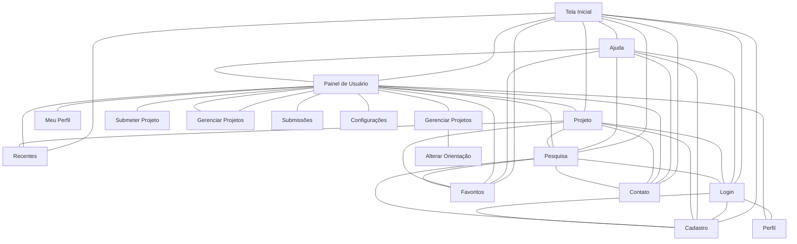
```mermaid
flowchart TD
    A[Tela Inicial] --- B[Login]
    A --- C[Favoritos]
    A --- D[Ajuda]
    A --- E[Contato]
    A --- F[Recentes]
    A --- G[Pesquisa]
    A --- H[Projeto]
    A --- I[Painel de Usuário]
    A --- J[Cadastro]
    B --- J
    B --- K[Recuperação]
    J --- B
    D --- C
    D --- B
    D --- E
    D --- G
    D --- I
    D --- J
    I --- C
    I --- H
    I --- G
    I --- F
    I --- E
    I --- L[Meu Perfil]
    I --- M[Gerenciar Projetos]
    I --- N[Submeter Projeto]
    I --- O[Configurações de conta]
    H --- C
    H --- E
    H --- J
    H --- F
    H --- G
    H --- B
    G --- B
    G --- C
    G --- E
    G --- J
    I --- K[Perfil]
    I --- O[Gerenciar Projetos]
    I --- P[Submissões]
    I --- Q[Configurações]
    M --- R[Alterar Orientação]
```

### A. Tela 1: Início

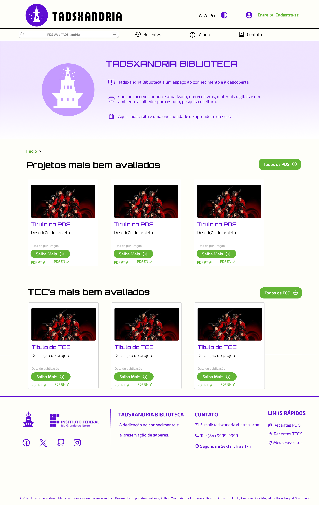

[LINK para o Figma correspodente](https://www.figma.com/design/3UFS72aU3maaqUMUDDRMsi/IHC---TADSxandria?node-id=817-3431&t=Z5A52AafKHZZjmss-1)

### B. Tela 2: Pesquisa

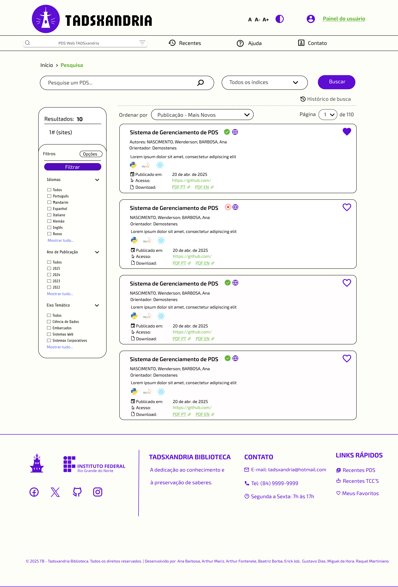

[LINK para o Figma correspodente](https://www.figma.com/design/3UFS72aU3maaqUMUDDRMsi/IHC---TADSxandria?node-id=817-5625&t=Z5A52AafKHZZjmss-1)

### C. Tela 3: Visualizar projeto

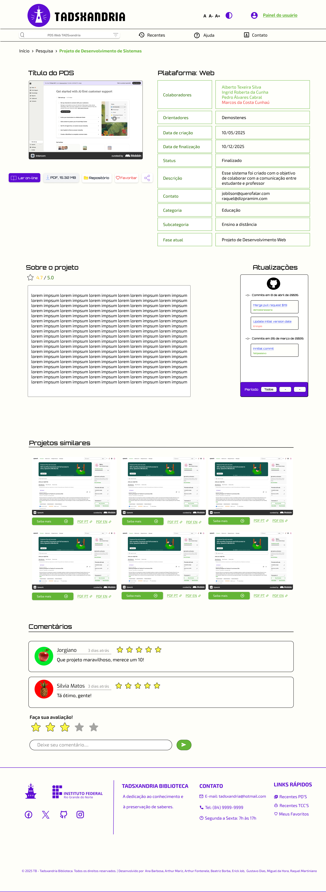

[LINK para o Figma correspodente](https://www.figma.com/design/3UFS72aU3maaqUMUDDRMsi/IHC---TADSxandria?node-id=817-2996&t=Z5A52AafKHZZjmss-1)

### D. Tela 4: Painel de Usuário

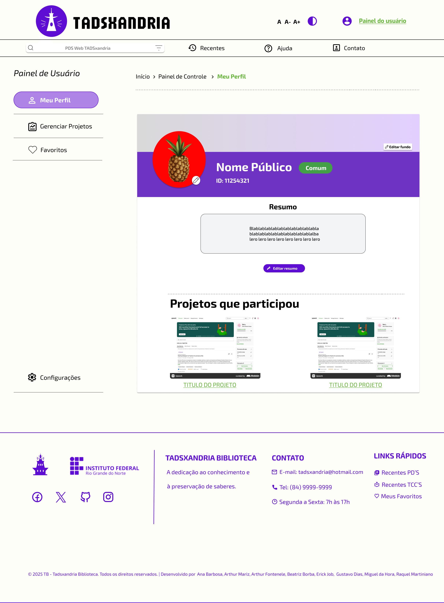

[LINK para o Figma correspodente](https://www.figma.com/design/3UFS72aU3maaqUMUDDRMsi/IHC---TADSxandria?node-id=843-5024&t=mnPOCIIczr6tkmv9-1)

### E. Tela 5: Ajuda

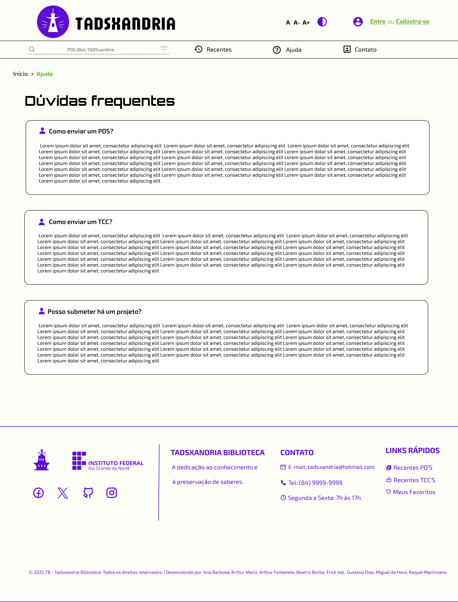

[LINK para o Figma correspodente](https://www.figma.com/design/3UFS72aU3maaqUMUDDRMsi/IHC---TADSxandria?node-id=352-673&t=I7pIzEFzUFCgMUtT-1)

### F. Tela 6: Contato

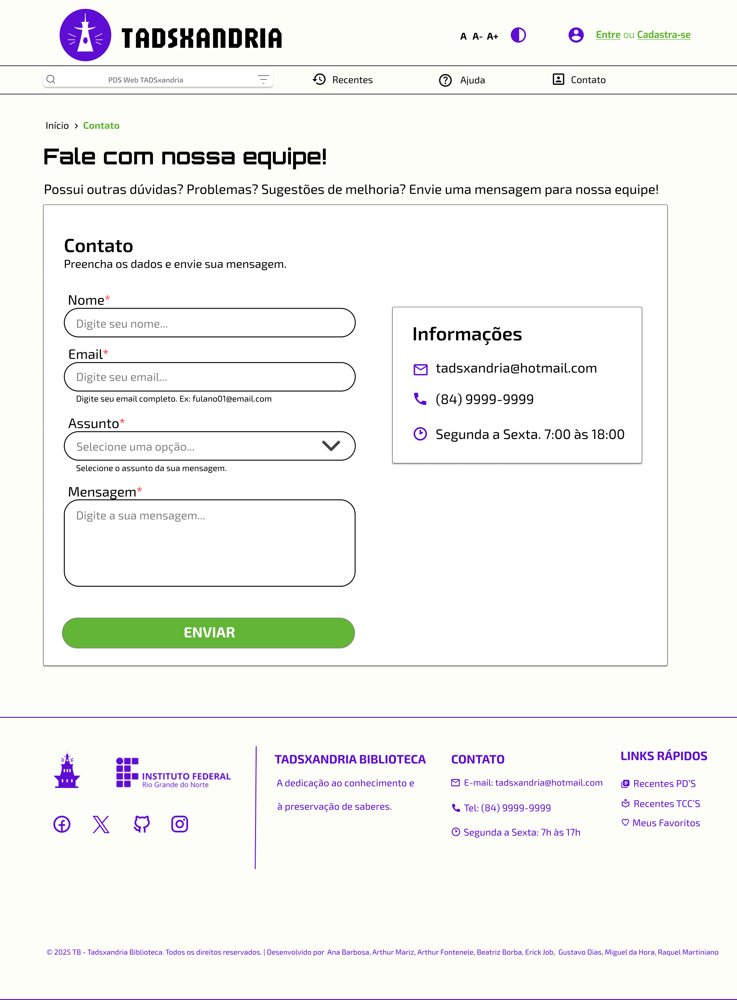

[LINK para o Figma correspodente](https://www.figma.com/design/3UFS72aU3maaqUMUDDRMsi/IHC---TADSxandria?node-id=369-1283&t=I7pIzEFzUFCgMUtT-1)

### G. Tela 7: Login de usuário

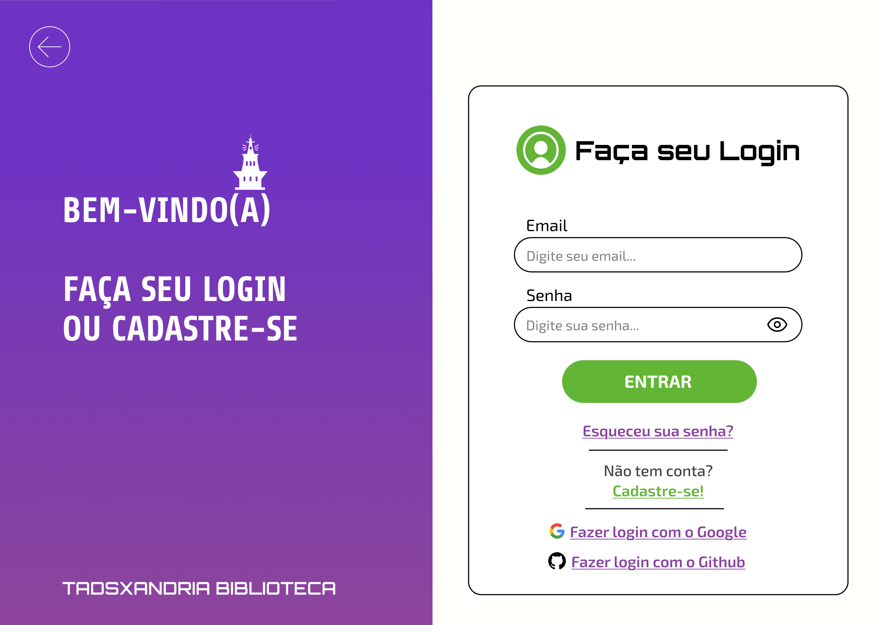

[LINK para o Figma correspodente](https://www.figma.com/design/3UFS72aU3maaqUMUDDRMsi/IHC---TADSxandria?node-id=249-423&t=I7pIzEFzUFCgMUtT-1)

### H. Tela 8: Cadastro de usuário

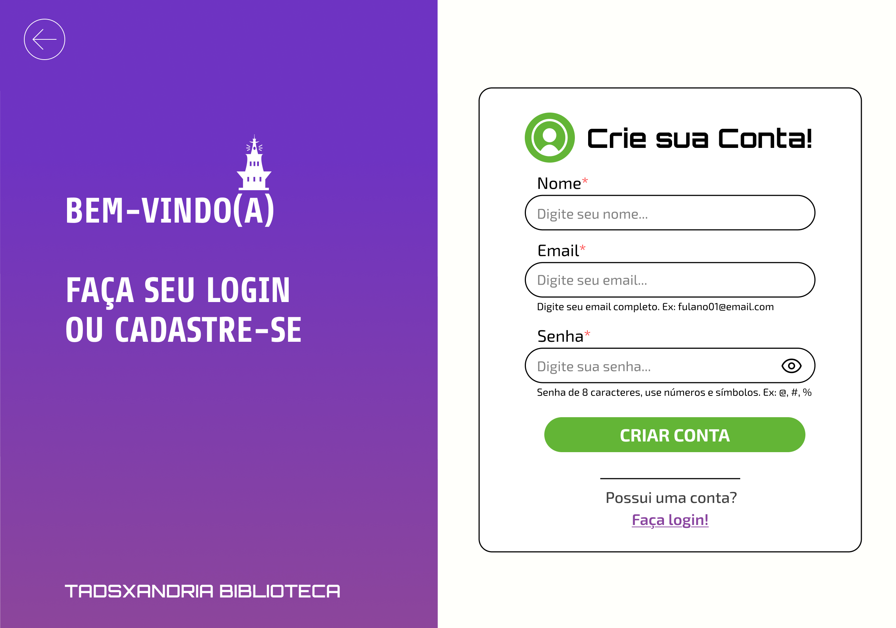

[LINK para o Figma correspodente](https://www.figma.com/design/3UFS72aU3maaqUMUDDRMsi/IHC---TADSxandria?node-id=256-664&t=I7pIzEFzUFCgMUtT-1)

### I. Tela 9: Recuperação de senha

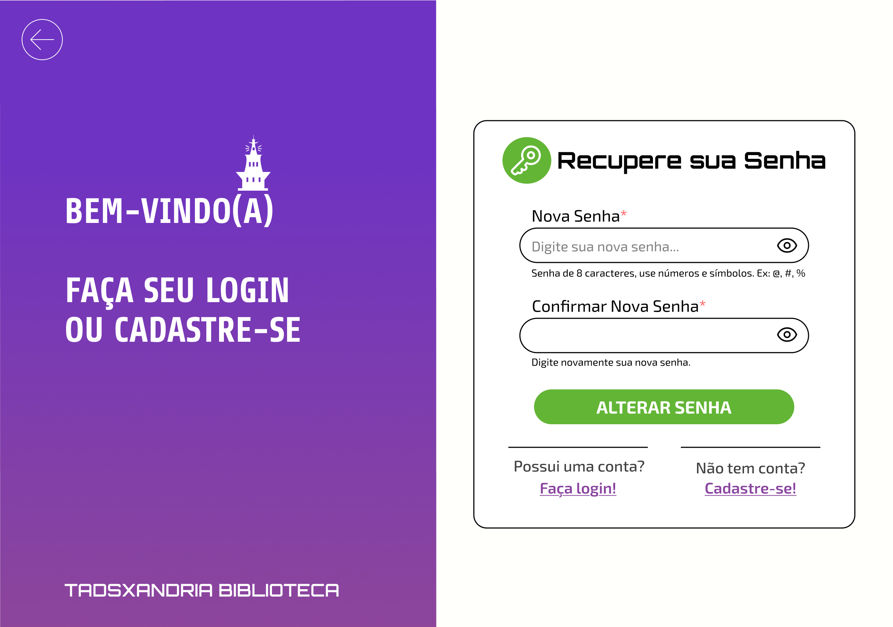

[LINK para o Figma correspodente](https://www.figma.com/design/3UFS72aU3maaqUMUDDRMsi/IHC---TADSxandria?node-id=260-666&t=I7pIzEFzUFCgMUtT-1)

### J. Tela 10: Recuperação de senha com sucesso

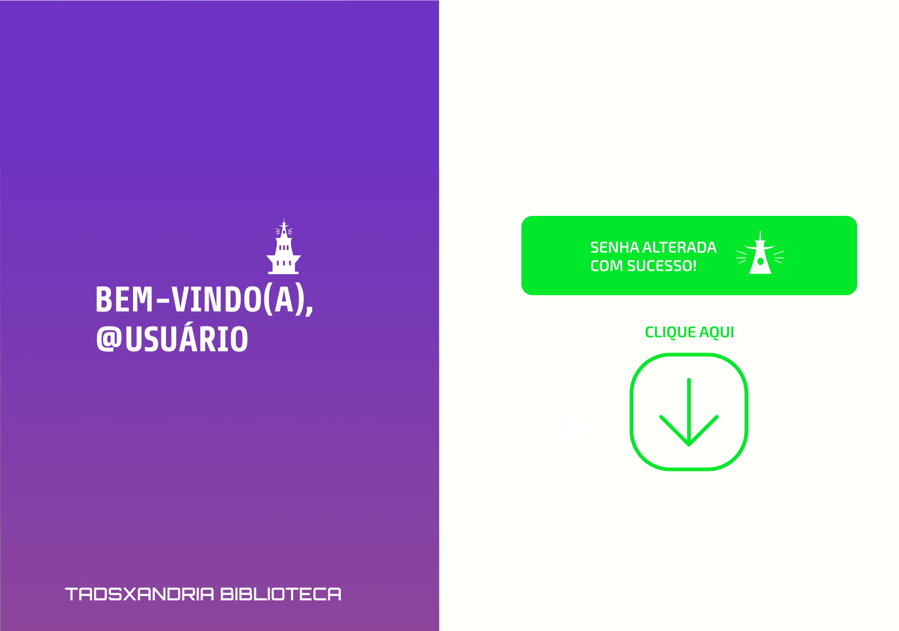

[LINK para o Figma correspodente](https://www.figma.com/design/3UFS72aU3maaqUMUDDRMsi/IHC---TADSxandria?node-id=480-1232&t=I7pIzEFzUFCgMUtT-1)

### K. Tela 11: Cadastro com sucesso

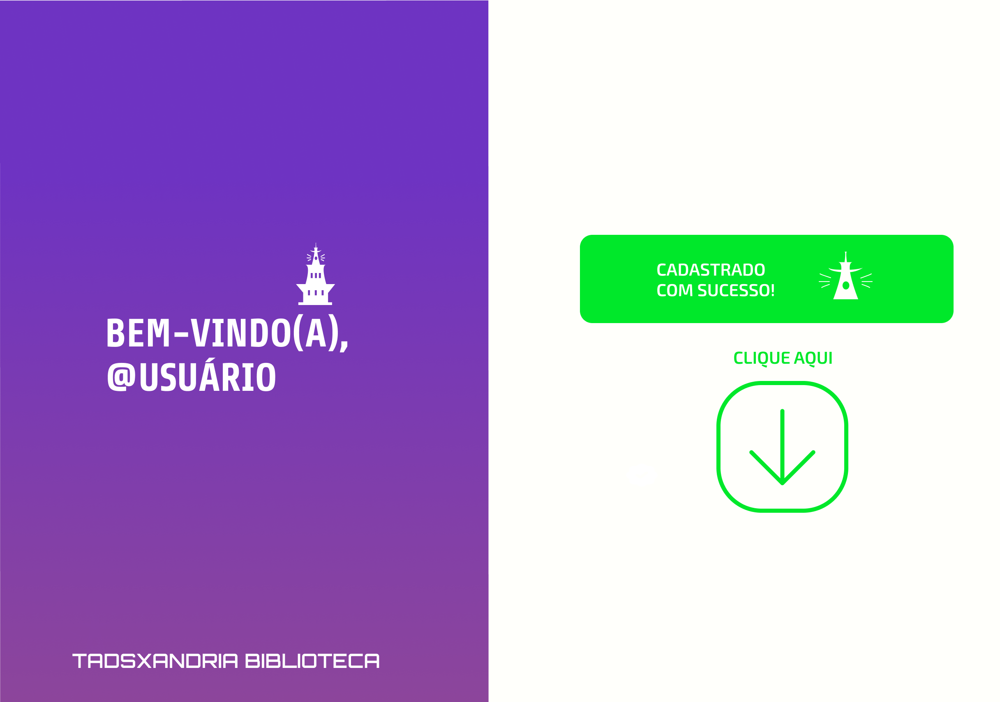

[LINK para o Figma correspodente](https://www.figma.com/design/3UFS72aU3maaqUMUDDRMsi/IHC---TADSxandria?node-id=480-1367&t=I7pIzEFzUFCgMUtT-1)

### L. Tela 12.1: Editar projeto - Parte 1

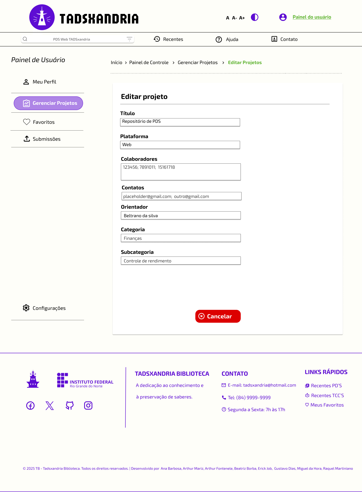

[LINK para o Figma correspodente](https://www.figma.com/design/3UFS72aU3maaqUMUDDRMsi/IHC---TADSxandria?node-id=892-8034&t=mnPOCIIczr6tkmv9-1)

##    Tela 12.2: Editar projeto - Parte 2

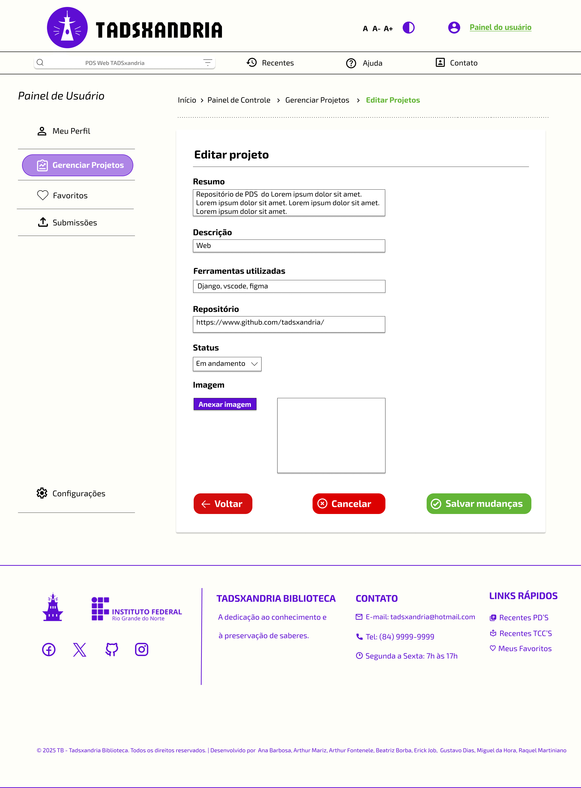

[LINK para o Figma correspodente](https://www.figma.com/design/3UFS72aU3maaqUMUDDRMsi/IHC---TADSxandria?node-id=892-8196&t=8IC0Fvo0PS1fm0Rl-1)

### M. Tela 13: Submeter projeto

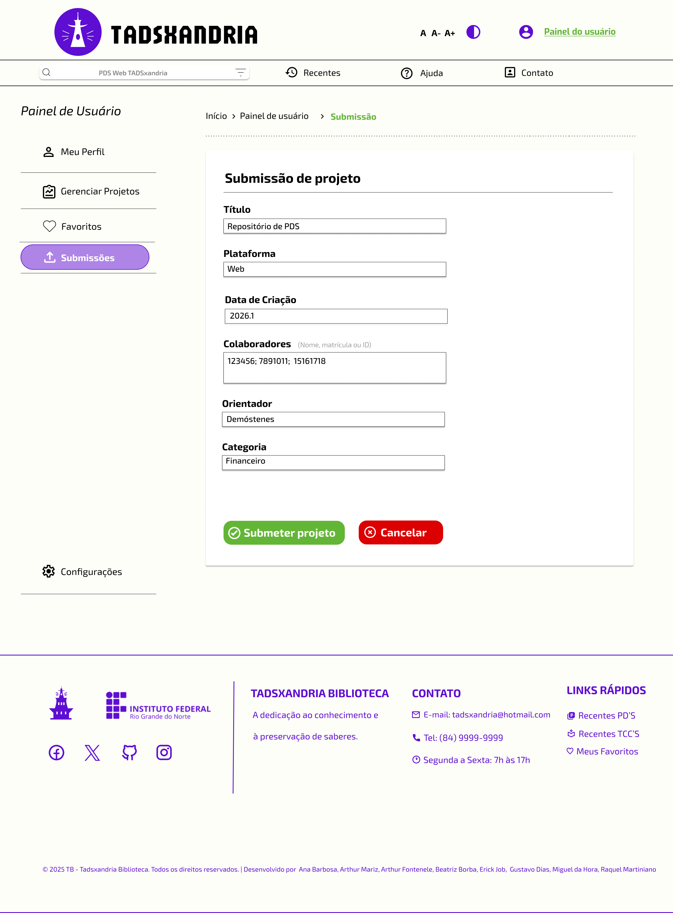

[LINK para o Figma correspodente](https://www.figma.com/design/3UFS72aU3maaqUMUDDRMsi/IHC---TADSxandria?node-id=852-9173&t=mnPOCIIczr6tkmv9-1)

### N. Tela 14: Gerenciar projeto

[LINK para o Figma correspodente](https://www.figma.com/design/3UFS72aU3maaqUMUDDRMsi/IHC---TADSxandria?node-id=852-8889&t=mnPOCIIczr6tkmv9-1)

### O. Tela 15: Favoritos

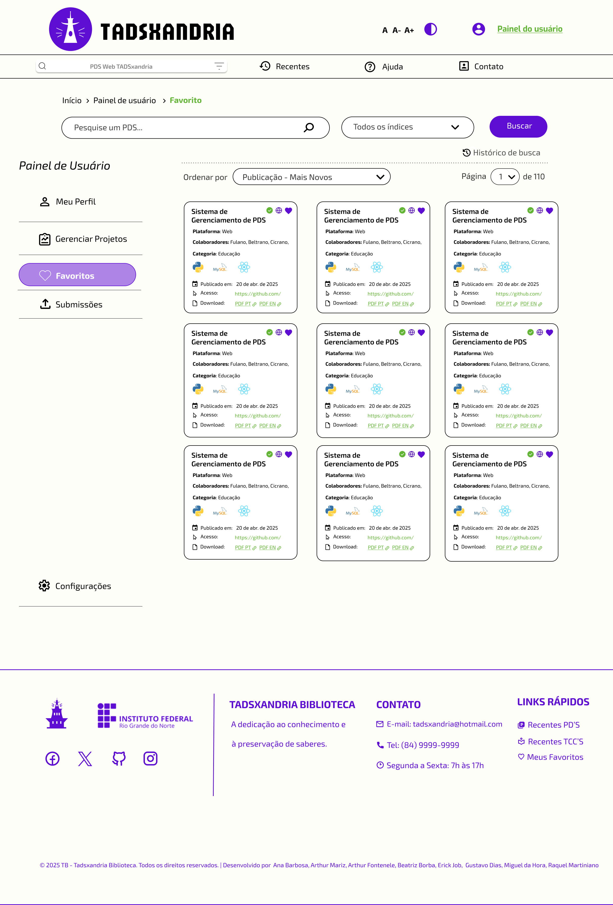

[LINK para o Figma correspodente](https://www.figma.com/design/3UFS72aU3maaqUMUDDRMsi/IHC---TADSxandria?node-id=846-5621&t=mnPOCIIczr6tkmv9-1)

### P. Tela 16: Alterar Orientação - Parte 1

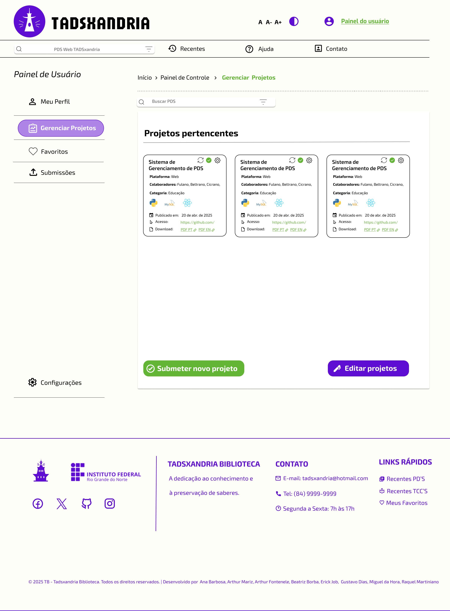

[LINK para o Figma correspodente](https://www.figma.com/design/3UFS72aU3maaqUMUDDRMsi/IHC---TADSxandria?node-id=852-8889&t=93eAVH75kmEDMUeM-1)

### P. Tela 16: Alterar Orientação - Parte 2

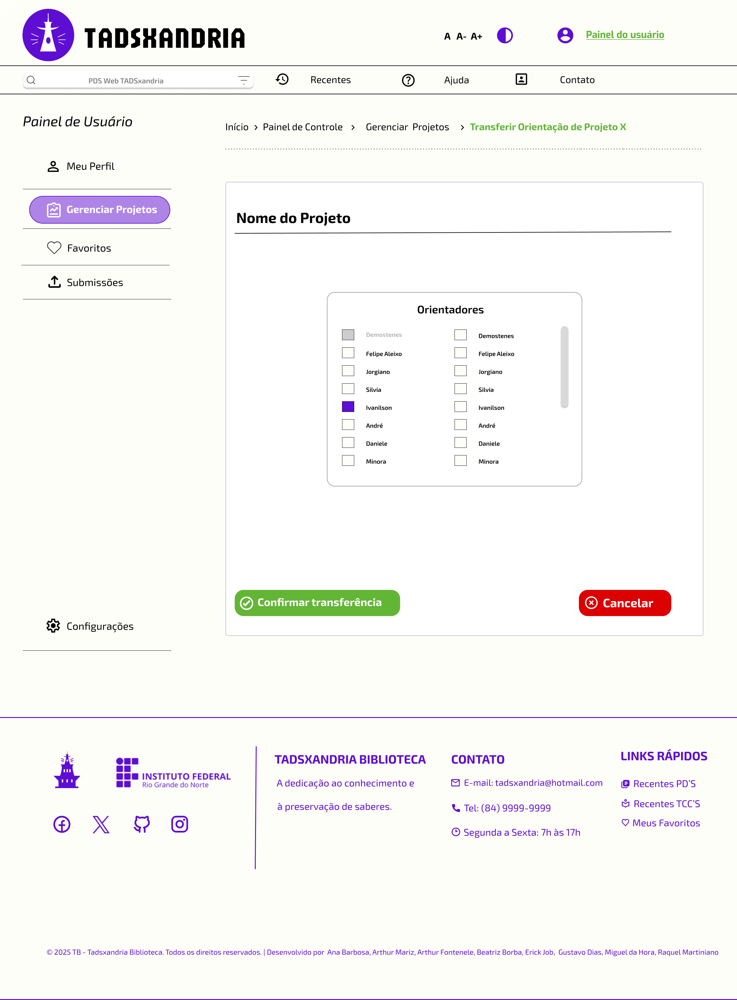

[LINK para o Figma correspodente](https://www.figma.com/design/3UFS72aU3maaqUMUDDRMsi/IHC---TADSxandria?node-id=1571-3474&t=AaUREG1WzUa389UX-1)

